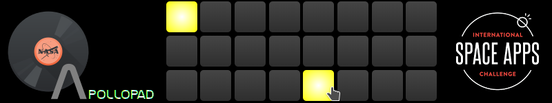

# ApolloPad (development)

ApolloPad is an open source drum pad that allows you to make music with real space sounds directly from your browser.

Participant of the [International SpaceApps Challenge 2015](https://2015.spaceappschallenge.org/project/apollopad/).

[DEMO](http://gustawho.com/apollopad)
